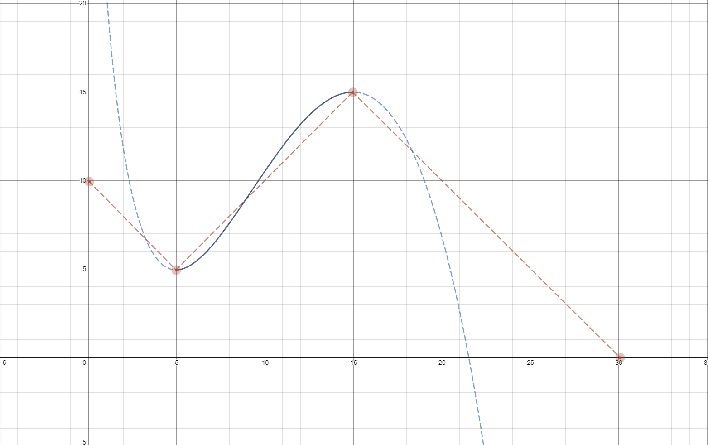

# WayFinder
Curved Trajectory Generator and Follower.

Wayfinder is designed around [WML](https://github.com/wml-frc) and includes the drivetrain so the library can follow a built path. Support for other systems may be implemented in the future, If you're an FRC team and not using WML. It's probably better to use WPI's official trajectory utility.

Otherwise... WELCOME.

## Spline Trajectory
WayFinder uses the Catmull-Rom Spline algorithm to determine it's path from `A` to `B`. A path using this algorithm has a minimum of two waypoints and two control points. Below is an example with two waypoints.

- path(reversed = false)
- wpt1(x = 5, y = 5)
- wpt2(x = 15, y = 15)
- ctrlPt1(x = 0, y = 10)
- ctrlPt2(x = 30, y = 0)

In the above example, the robot would start at 0 degrees. Then follow the curved path from wypt1 to wypt2. using the two control points to adjust the intesitiy of wypt1 & wypt2


## Usage

### Building paths

- WayFinder uses waypoints in meters to get from A to B, mapping out your robot starting location on the feild (X & Y position) and where you want it to end up (X & Y) using waypoints in between them to define the curved trajectory the robot will take to it's target. (It uses the `catmull-rom spline` algorithm to acheive this. You can see how this style of curve reacts in helpfull apps like desmos https://www.desmos.com/calculator/9kazaxavsf and others like it)

- You can have an infinite amount of waypoints. But are required to have 2 control points no matter how small or big the spline is. This is to insure you can control it's starting and end curves accurately in the spline. Unlike the waypoints in between which uses the waypoints before and after to define it's curve. By default the control points are the same value as the start and end of your spline.

- After defining your waypoints (in meters) and control points (in meters), you'll also need to call the `buildPath()` function to compile your spline into a path. This converts your waypoints into a curved trajectory with known length, gradients and positions it can use in the follower. (Because this uses loops and a few calculations to compile. Call it only at startup NOT IN PERIODIC)


Robot.cpp
```cpp
#include "Robot.h"

using namespace frc;
using namespace wml;

Drivetrain *drivetrain; // Create your drivetrain instance (needs to be the same object you use for manual driving and auto driving)

wayfinder::WayFinder *wayFinder; // Create your wayfinder instance


/**
 * Configure your wayfinder options to be used during auto
 */
wayfinder::RobotControl::Config wfdConfig{
	drivetrain, // Pass in your drivetrain (requires a pointer)

	true, // Invert your left encoder
	false, // Invert your right encoder

	0.3, // P for PID
	0.001, // I
	0.024, // D

	8.24, // Gearbox reduction. (e.g 8.24 rotations = 1 wheel rotation)
	0.1524, // Wheel diameter in meters
	0.5, // Max speed of the robot overall
	0.3, // Max speed of the robot when turning (overrided by overall max speed if turning max speed is higher)
};

/**
 * Create a spline using waypoints and control points
 */
wayfinder::Path::sSpline spline1{
	{{1,4}, {5,3}, {7,1.5}, {8,1}}, // Waypoints

	{1,1}, // Start control point
	{9,9} // End Control point
};

/**
 * Path to use with follower
 */
wayfinder::Path::sPath path;

// Robot Logic
void Robot::RobotInit() {
	wayFinder = new wayfinder::WayFinder(&wfdConfig); // Initialize wayFinder and pass in your config
	path = wayFinder->buildPath(spline1); // Build a path from your spine
}

void Robot::RobotPeriodic() {}

// Dissabled Robot Logic
void Robot::DisabledInit() {}
void Robot::DisabledPeriodic() {}

// Auto Robot Logic
void Robot::AutonomousInit() {}
void Robot::AutonomousPeriodic() {}

// Manual Robot Logic
void Robot::TeleopInit() {}
void Robot::TeleopPeriodic() {}

// Test Logic
void Robot::TestInit() {}
void Robot::TestPeriodic() {}
```

The above code will initialize wayfinder and build a curved path from waypoint1 to waypoint4 passing through every waypoint in between.


### Using path in follower

- After building your path you can use WayFinders inbuilt follower to follow the path using the provided drivebase. Uses your gyroscope and encoders. (The follower is also built for redundancy. It uses the average of both encoders to determine the distance traveled. But if one encoder is unplugged during a game, or by accident. It will detect this and use the other encoder. May undershoot or overshoot)

Robot.cpp (Below uses the same values as before & assumes the instances are defined somewhere else.)
```cpp
#include "Robot.h"

using namespace frc;
using namespace wml;

// Robot Logic
void Robot::RobotInit() {
	wayFinder = new wayfinder::WayFinder(&wfdConfig); // Initialize wayFinder and pass in your config
	path = wayFinder->buildPath(spline1); // Build a path from your spine
}

void Robot::RobotPeriodic() {}

// Dissabled Robot Logic
void Robot::DisabledInit() {}
void Robot::DisabledPeriodic() {}

// Auto Robot Logic
void Robot::AutonomousInit() {}
void Robot::AutonomousPeriodic() {
	if (wayFinder->followPath(path, dt)) {
		// Do code after path has finished
	}

	if (wayFinder->atWayPoint(2, path)) {
		// do something at node 2
		std::cout << "Reached a node" << std::endl;
	}
	std::cout << wayFinder->getCurrentLocation(&wfdConfig, true);
}
// Manual Robot Logic
void Robot::TeleopInit() {}
void Robot::TeleopPeriodic() {}

// Test Logic
void Robot::TestInit() {}
void Robot::TestPeriodic() {}
```

- You can customise your approach to following the path as much as you want. WayFinder provides many useful methods you can use in your auto. 

List of methods:
```cpp
sPath buildPath(sSpline spline); // returns a compiled path

bool followPath(sPath path, double dt, bool reverse = false); // Follows path using input dt, returns true once path is complete

bool atWayPoint(int node, sPath); // Returns true if robot is at the waypoint node or has traveled past it

double getCurrentLocation(Config *config, bool inMeters = false); // Returns the robots current location in spline. Either in rotations of wheel or meters

void setBarStop(double bar); // Lowers the completion bar of the follower (if spline length is 8, and bar is set to 0.5, robot will stop at 7.5 or after) Best for robots with large amounts of encoder drift or PID values which don't completely stop at the final point

sPoint getSplinePoint(double t, sSpline spline); // Returns the x,y coordinates along a spline. Where t represents meters along spline

sPoint getSplineGradientPoints(double t, sSpline spline); // Returns the gradient values of a point along the spline

double getSplineAngle_Rad(double t, sSpline spline); // Returns the angle of the robot at a certain point in the spline in radians

double getSplineAngle_Deg(double t, sSpline spline); // Returns the angle of the robot at a certain point in the spline in degrees

double calculateSegLength(int node, sSpline spline); // Calculates the length between the input waypoint node and the next.

```

<sub><sup>readme writted by [@CJBuchel](https://github.com/CJBuchel), 25/20/20</sup></sub>
