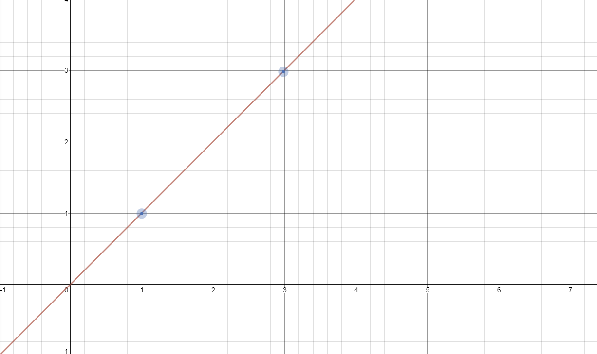

# WayFinder
Curved Trajectory Generator and Follower.

Wayfinder is designed around [WML](https://github.com/wml-frc) and includes the drivetrain so the library can drive the robot for you. Support for other systems may be implemented in the future, If your an FRC team and not using WML. It's probably better to use WPI's official trajectory utility.

Otherwise... WELCOME.

<!-- ## Linear Trajectory
WayFinder provides multiple ways to get from `A` to `B`. Below is an example of a linear path with 2 waypoints. 

- path(reverse = false)
- wpt1(x = 1, y = 1, Angle = -45)
- wpt2(x = 3, y = 3, Angle = 45)

In the above example, the robot would start at 0 degrees turn -45 degrees on the spot at waypoint 1. Then travel to waypoint 2's (x,y) and turn on the spot 45 degrees. And the path was not reversed. Meaning the robot would not drive backwards. -->

## Spline Trajectory
WayFinder uses the Catmull-Rom Spline algorithm to determine it's path from `A` to `B`. A path using this algorithm has a minimum of two waypoints and two control points. Below is an example with two waypoints.

- path(reversed = false)
- wpt1(x = 5, y = 5)
- ctrlPt1(x = 0, y = 10)
- wpt2(x = 15, y = 15)
- ctrlPt2(x = 0, y = 30)

In the above example, the robot would start at 0 degrees. Then follow the curved path from wypt1 to wypt2.

## Usage